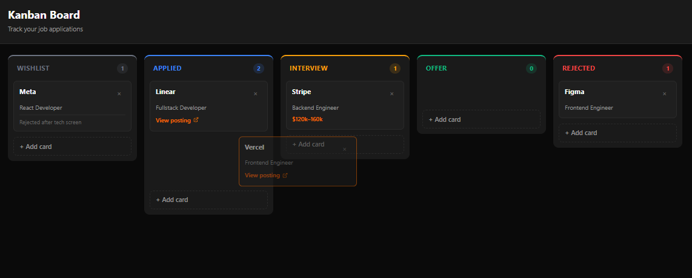

# Kanban Board

A job application tracker with drag-and-drop between columns. Built with **Next.js 16**, **React 19**, **dnd-kit**, and **localStorage** persistence.

## Features

- **5 columns** — Wishlist, Applied, Interview, Offer, Rejected
- **Drag & drop** — between columns and within a column (`@dnd-kit/core` + `@dnd-kit/sortable`)
- **Keyboard accessibility** — pick up with Space, move with arrows, drop with Space, cancel with Escape
- **Add / edit / delete cards** — modal form with URL validation
- **LocalStorage persistence** — debounced save, restore on reload
- **URL validation** — only `http:` and `https:` protocols allowed, length capped at 2048 chars
- **Auto-scroll** — when dragging near the viewport edge
- **Dark theme**

## Tech Stack

| Layer | Tech |
|---|---|
| Framework | Next.js 16 (App Router) |
| UI | React 19 |
| Language | TypeScript (strict) |
| State | `useState` + `localStorage` |
| DnD | `@dnd-kit/core`, `@dnd-kit/sortable`, `@dnd-kit/utilities` |
| Styling | CSS Modules |

## Architecture Decisions

### Immutable state in `lib/kanban.ts`

All business logic lives in pure functions: `createCard`, `addCard`, `removeCard`, `moveCard`, `updateCard`. Every function returns a new `Board` — never mutates. React relies on reference equality to detect changes.

### Server vs Client boundary

`BoardClient` is dynamically imported with `ssr: false` — drag & drop is client-only. dnd-kit generates unique `aria-describedby` IDs that cause hydration mismatch under SSR.

### Defense in depth for URLs

Three layers of URL validation:
1. **Form** (`CardModal`) — `isValidUrl` — early UX feedback
2. **Sanitizer** (`lib/kanban.ts`) — `sanitizeUrl` — invariant on create / update
3. **Render** (`Card`) — `isSafeUrl` — final guard before `<a href>`

Blocks `javascript:`, `data:`, `file:` protocols. Protects against XSS via href.

### LocalStorage with debounced save

State is saved to `localStorage` with a 300ms debounce. Prevents writing on every mousemove during drag. Key is versioned (`kanban-board-v1`) so schema changes don't break old data.

  ## Roadmap
Unit tests for moveCard — the off-by-one logic deserves tests
 Server persistence — Prisma + PostgreSQL instead of localStorage
 Multi-user with auth — different boards per user
 Search and filters — by company, position, tag
 Keyboard shortcuts — N for new card, / for search
 Move history — undo last drag
 Dark / light theme — currently dark only
 ## Author
Marina Dev — Fullstack Developer

## GitHub: @marinaburyakova

Portfolio: mint-apps.com

License
MIT